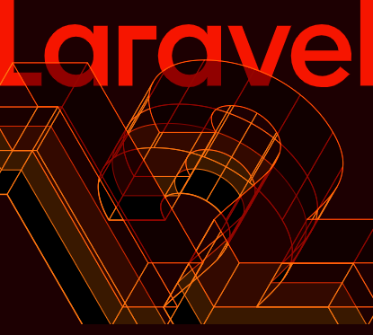

<div align="center" style="display: block; margin-bottom: 20px;">
  <a href="https://laravel.com/docs/12.x" target="_blank" style="text-decoration: none;">
    
  </a>
  <span style="display: inline-block; vertical-align: middle; font-size: 25px; color: #ccc; margin: 0 10px 0 7px;">+</span>
  <a href="https://nativephp.com/docs/desktop/2" target="_blank">
    
  </a>
  <span style="display: inline-block; vertical-align: middle; font-size: 11px; color: #ccc; margin: 25px 10px 0 5px;">Desktop</span>
</div>

<h2 align="center">Laravel 12 + NativePHP Desktop</h2>

<p align="center">
<a href="https://packagist.org/packages/laravel/framework"></a>
</p>

# 🚀 Laravel NativePHP Desktop App

Aplikasi desktop modern yang dibangun dengan kekuatan **Laravel 12**, **NativePHP**, dan **HTMX**. Proyek ini mengintegrasikan fitur manajemen notifikasi otomatis dan antarmuka *Dark-First* yang responsif.

## ✨ Fitur Utama

* **Native Desktop Experience**: Berjalan sebagai aplikasi native di Windows/macOS/Linux menggunakan NativePHP.
* **Auto-Clean Notifications**: Pembersihan otomatis notifikasi lama berdasarkan preferensi user (3, 7, 14, atau 30 hari).
* **Background Scheduler**: Menggunakan *Child Process* NativePHP untuk menjalankan task scheduler tanpa memerlukan Cron Job eksternal.
* **Dark-First Interface**: Antarmuka default gelap yang cerdas dengan pencegahan *flicker/blink* saat aplikasi dimuat.
* **Reactive UI with HTMX**: Interaksi server-side yang mulus tanpa reload halaman penuh.
* **SQLite Powered**: Database lokal yang ringan dan cepat, ideal untuk aplikasi desktop.

## 🛠️ Tech Stack

- **Engine:** [PHP 8.4+]()
- **Framework:** [Laravel 12](https://laravel.com/docs/12.x)
- **Desktop Wrapper:** [NativePHP Desktop](https://nativephp.com/docs/desktop/2)
- **Frontend Interactivity:** [HTMX](https://htmx.org) & [Alpine.js](https://alpinejs.dev)
- **Styling:** [Tailwind CSS](https://tailwindcss.com)
- **Database:** SQLite 3


## 🚀 Instalasi

```bash 
composer install

npm install && npm run build

cp .env.example .env

php artisan key:generate

touch database/database.sqlite

php artisan migrate
```

## ⚙️ Jalankan Aplikasi (Mode Development)

```bash 
php artisan native:migrate

composer native:dev
```

## 📦 Build & Distribution
```bash 
php artisan native:build
```

